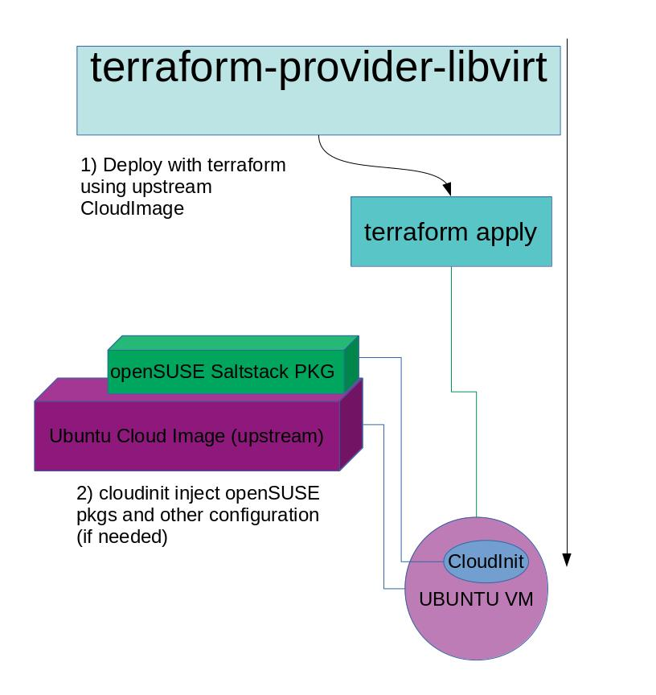
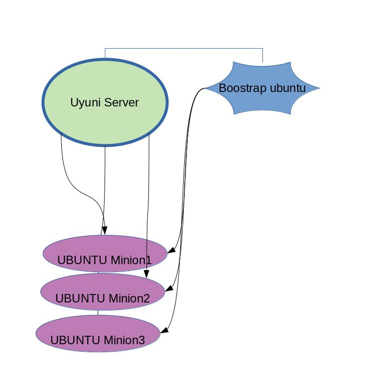

# ubuntu-cloud-image-minion

Following the UNIX Design, doing only 1 thing, doing it well, the goal of this project is:

* deploy with terraform-libvirt-provider
* use Ubuntu upstream Cloud Image.
* use cloudinit for installing openSUSE saltstack packages, and other minimal configurations.

Once the VM is created, you can boostrap this VM against your Uyuni-Server. (this is outside the scope of this project)


# USER Documentation

## Howto:

If you have terraform and terraform-libvirt-plugin already installed, after cloning this project do:

```bash
terraform init
terraform apply
```

# Installation:

We will use only https://github.com/dmacvicar/terraform-provider-libvirt  as dependency.

For installing the terraform-libvirt-provider have a look on release:
https://github.com/dmacvicar/terraform-provider-libvirt/releases

You will also need the terraform golang binary.
https://github.com/dmacvicar/terraform-provider-libvirt#installing

You can also use the pkgs https://github.com/dmacvicar/terraform-provider-libvirt#using-packages
And you will have an Ubuntu Instance with openSUSE salt-pkgs.

## Design of this project.



### Additional steps: boostrapping ubuntu image against SUSE-Manager.

With the VM and the ip of your Ubuntu Server, you can then boostrap the minion against uyuni server ( via gui or CLI). 
This is out of scope of this project.




# Developer Documentation:

At moment this is under development.
